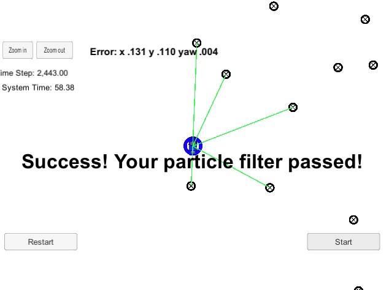

# Particle Filter Localization Project Code

This repository contains all the code for the final project for the Localization course in Udacity's Self-Driving Car Nanodegree.

A robot has been kidnapped and transported to a new location! Luckily it has a map of this location, a (noisy) GPS estimate of its initial location, and lots of (noisy) sensor and control data.

In this project, it will implement a 2 dimensional particle filter in C++. This particle filter will be given a map and some initial localization information (analogous to what a GPS would provide). At each time step this filter will also get observation and control data. 

## Compiling
This project involves the Term 2 Simulator which can be downloaded [here](https://github.com/udacity/self-driving-car-sim/releases)

This repository includes two files that can be used to set up and intall [uWebSocketIO](https://github.com/uWebSockets/uWebSockets) for either Linux or Mac systems. For windows you can use either Docker, VMware, or even [Windows 10 Bash on Ubuntu](https://www.howtogeek.com/249966/how-to-install-and-use-the-linux-bash-shell-on-windows-10/) to install uWebSocketIO. 

Once the install for uWebSocketIO is complete, the main program can be built and ran by doing the following from the project top directory.

```
mkdir build
cd build
cmake ..
make
./particle_filter
```

The majority of changes comparing with [start code](https://github.com/udacity/CarND-Kidnapped-Vehicle-Project) was in `./src/particle_filter.cpp`.

## Accuracy

>Does your particle filter localize the vehicle to within the desired accuracy? This criteria is checked automatically when you do ./run.sh in the terminal. If the output says "Success! Your particle filter passed!" then it means you’ve met this criteria.


Yes, I did it:



## Performance

>Does your particle run within the specified time of 100 seconds? This criteria is checked automatically when you do ./run.sh in the terminal. If the output says "Success! Your particle filter passed!" then it means you’ve met this criteria.

Yes, I made it in 55.62 seconds. Shown above.

## General

>Does your code use a particle filter to localize the robot?There may be ways to “beat” the automatic grader without actually implementing the full particle filter. You will meet this criteria if the methods you write in particle_filter.cpp behave as expected.


Yes, I used the particle filter. Futhermore, I think this is much easier than the Kalman Filter for programming, no matter EKF or UKF :)